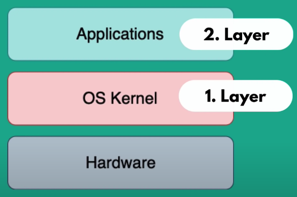

# Docker x Virtual Machine

OS usually have 2 layers, the kernel and the applications layer:

The OS Kernel is the part that communicates with the hardware components like CPU, memory and etc. The applications run on the kernel layer, so, they're based on the kernel.

Both Docker and VMs use virtualization to do their jobs, but whats the main difference between them?

Docker virtualizes the Applications layer, the VMs virtualize the complete operating system. So their main differences are:

- Size: Docker image is much smaller
- Speed: Docker container start and run much faster
- Compatibility: VM of any OS can run on any OS host
